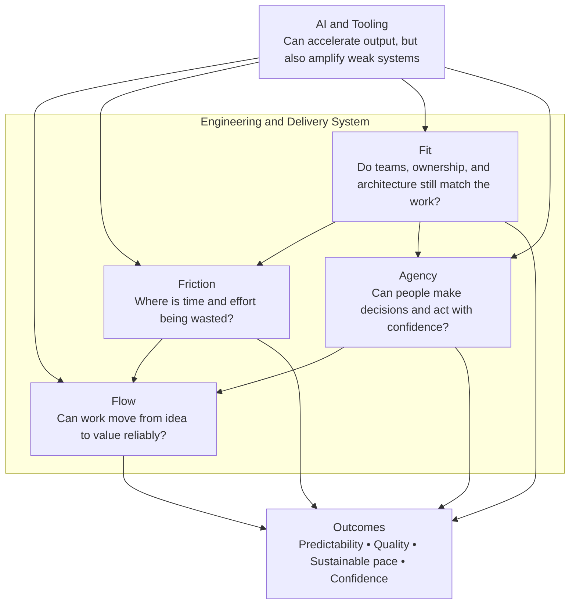
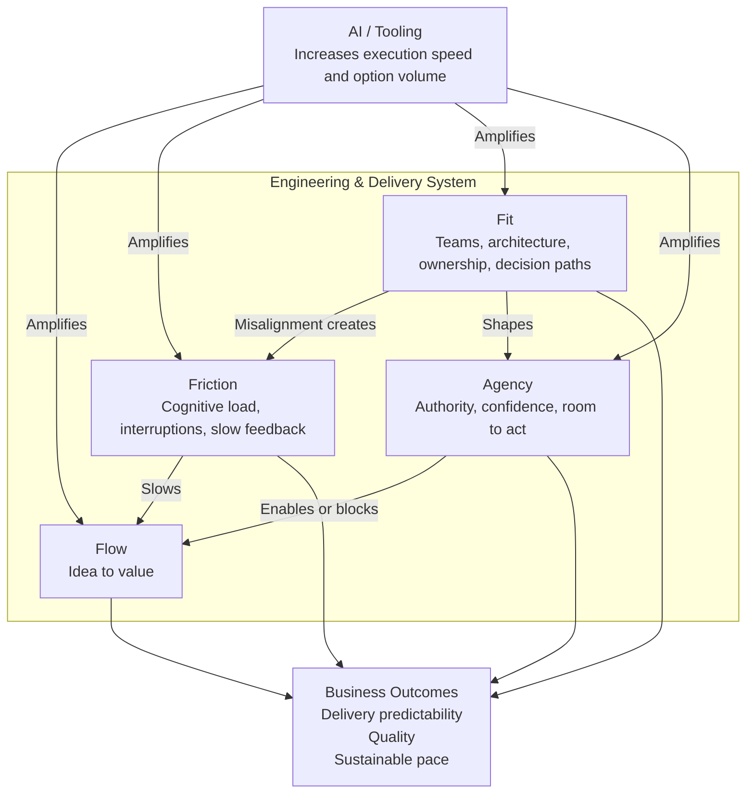
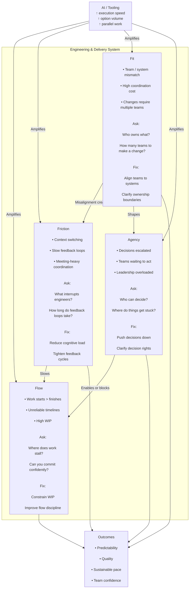

# Consultancy process

## Process illustrations

### Client-facing version

### Richer version

### Annotated

#### How to actually use this

This is not a “show and explain” diagram - it’s a thinking and probing tool.

In conversation:

* Start anywhere (usually Flow or symptoms)
* Follow edges:
  * “Why is Flow poor?” → Friction / Fit / Agency
* Use embedded questions directly

#### What makes this version useful

Compared to typical frameworks:

* **It encodes causality**
  * Not: 4 buckets
  * But:
    * Fit → Friction → Flow
    * Agency → Flow
* **It surfaces intervention points**
  * Each node includes:
    * what’s wrong
    * how to detect it
    * what to do
* **It makes AI secondary**
  * AI is an amplifier, not a root cause

### Constraints overlay

```mermaid
flowchart TD

    A["AI / Tooling<br/>↑ execution speed<br/>↑ option volume<br/>↑ parallel work"]

    subgraph S["Engineering & Delivery System"]

        B["Flow<br/>
        Symptoms:<br/>
        • Work starts > finishes<br/>
        • Unreliable timelines<br/>
        • High WIP<br/><br/>
        Ask:<br/>
        • Where does work stall?<br/>
        • Can you commit confidently?<br/><br/>
        Constraint test:<br/>
        • Is this where work visibly queues?<br/>
        • Does improving elsewhere fail to help?<br/><br/>
        Fix:<br/>
        • Constrain WIP<br/>
        • Improve flow discipline"]

        C["Friction<br/>
        Symptoms:<br/>
        • Context switching<br/>
        • Slow feedback loops<br/>
        • Meeting-heavy coordination<br/><br/>
        Ask:<br/>
        • What interrupts engineers?<br/>
        • How long do feedback loops take?<br/><br/>
        Constraint test:<br/>
        • Is this consuming disproportionate time?<br/>
        • Do people spend more time navigating than delivering?<br/><br/>
        Fix:<br/>
        • Reduce cognitive load<br/>
        • Tighten feedback cycles"]

        D["Fit<br/>
        Symptoms:<br/>
        • Team / system mismatch<br/>
        • High coordination cost<br/>
        • Changes require multiple teams<br/><br/>
        Ask:<br/>
        • Who owns what?<br/>
        • How many teams to make a change?<br/><br/>
        Constraint test:<br/>
        • Does structure force dependency on every change?<br/>
        • Are handoffs the real bottleneck?<br/><br/>
        Fix:<br/>
        • Align teams to systems<br/>
        • Clarify ownership boundaries"]

        E["Agency<br/>
        Symptoms:<br/>
        • Decisions escalated<br/>
        • Teams waiting to act<br/>
        • Leadership overloaded<br/><br/>
        Ask:<br/>
        • Who can decide?<br/>
        • Where do things get stuck?<br/><br/>
        Constraint test:<br/>
        • Is decision latency governing delivery?<br/>
        • Do people know what to do but still wait?<br/><br/>
        Fix:<br/>
        • Push decisions down<br/>
        • Clarify decision rights"]

    end

    A -->|"Amplifies"| B
    A -->|"Amplifies"| C
    A -->|"Amplifies"| D
    A -->|"Amplifies"| E

    D -->|"Misalignment creates"| C
    C -->|"Slows"| B
    D -->|"Shapes"| E
    E -->|"Enables or blocks"| B

    B --> F["Outcomes<br/>
    • Predictability<br/>
    • Quality<br/>
    • Sustainable pace<br/>
    • Team confidence"]

    C --> F
    D --> F
    E --> F

    G["Constraint Overlay<br/><br/>
    1. Locate the queue<br/>
    2. Identify what governs pace<br/>
    3. Test whether other improvements are masked<br/>
    4. Exploit the constraint<br/>
    5. Subordinate other changes to it<br/>
    6. Elevate only if needed<br/>
    7. Reassess once moved"]

    G -.-> B
    G -.-> C
    G -.-> D
    G -.-> E
```

#### What this overlay is doing

It adds a Theory of Constraints lens to the model.

We are no longer just asking:

* What is wrong?
* Where are the symptoms?

We are asking:

* What is the governing constraint?

Meaning:

* where is work truly queuing?
* what is limiting throughput or predictability?
* what, if fixed, would materially improve the system?
* what looks bad but is actually downstream noise?

#### How to identify the real constraint

Use this sequence.

##### 1. Locate the queue

Look for where work, decisions, or dependencies accumulate.

Examples:

* code waiting for review
* work waiting for product decisions
* teams waiting for another team
* leadership inbox as hidden approval system

This is the first clue.

##### 2. Ask what governs pace

Not: what feels annoying?

But: what actually sets the pace of delivery?

Examples:

* decision latency
* architecture coupling
* review/test cycle time
* dependency coordination

##### 3. Test for masking

A lot of organisations improve non-constraints.

Examples:

* better sprint rituals when architecture is the bottleneck
* more AI tooling when decision rights are the bottleneck
* happier dashboards when WIP is the bottleneck

Test:

If we improve this area, does the system materially move?

If no, it’s probably not the constraint.

##### 4. Exploit the constraint

Get the most out of the bottleneck before redesigning everything.

Examples:

* protect reviewer time if review is the bottleneck
* reduce inflow if WIP is the bottleneck
* pre-clarify decisions if leadership latency is the bottleneck

##### 5. Subordinate the rest

Align the rest of the system to support the constraint.

This is the bit most people skip.

Example:

If decision-making is the bottleneck, then:

* don’t increase work intake
* don’t increase parallel initiatives
* don’t push more output from AI into the system

##### 6. Elevate only if needed

Only after exploiting and subordinating do you invest in structural change.

Examples:

* re-team around ownership boundaries
* redesign approval models
* add platform support
* change governance for AI use

##### 7. Reassess

Once the main constraint moves, another one appears.

That matters for our engagement model because it means:

We don’t need to fix everything.
We need to move the governing constraint and stabilise the system.

#### How the overlay maps to our four core areas

##### If Flow is the constraint

Typical reality:

* too much WIP
* too many active initiatives
* work thrashing across the system

Best interventions:

* limit intake
* reduce parallel work
* improve completion discipline

##### If Friction is the constraint

Typical reality:

* engineers constantly interrupted
* slow feedback loops
* process/tooling drag dominating effort

Best interventions:

* reduce context switching
* improve dev environment / feedback loops
* cut unnecessary coordination

##### If Fit is the constraint

Typical reality:

* system boundaries and team boundaries misaligned
* every change crosses multiple teams
* ownership ambiguity creates handoffs

Best interventions:

* redefine ownership
* reduce coupling
* simplify team interaction modes

##### If Agency is the constraint

Typical reality:

* people know the answer but cannot act
* leadership becomes the hidden bottleneck
* decisions escalate by default

Best interventions:

* clarify decision rights
* create local authority
* reduce approval dependency

#### Why this matters for AI specifically

AI often improves local output, but that only helps if the local area is the constraint.

If the real bottleneck is:

* decision-making
* cross-team dependencies
* unclear ownership
* review / quality gates

Then AI can make things worse by:

* increasing inflow
* generating more half-finished work
* creating more options than the system can absorb

> AI should be evaluated against the current system constraint, not by output volume alone.

#### How to use this in a client conversation

A simple pattern:

#### Step 1 - Start with symptoms

“Where does work tend to queue or get stuck?”

#### Step 2 - Map the answer to:

* Flow
* Friction
* Fit
* Agency

#### Step 3 - Test the candidate constraint

“If we fixed that, would the system materially improve?”

#### Step 4 - Distinguish root cause from secondary pain

“What looks bad here, but is actually downstream of something else?”

#### The key value of this overlay

Without it, our model risks becoming:

* broad
* thoughtful
* but non-prioritised

With it, our model becomes:

* diagnostic
* selective
* intervention-oriented

Which is much closer to:

get in, identify the governing constraint, change the system, get out
